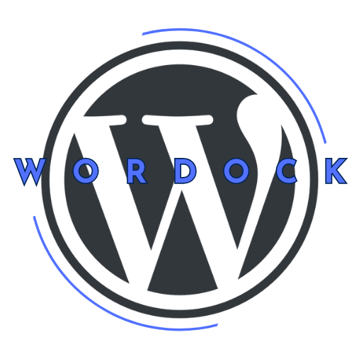

<div align="center">
  
</div>
# **Wordock**

**Wordock** is a Dockerized WordPress environment designed for streamlined local development and deployment. It uses Nginx, PHP-FPM, MySQL, phpMyAdmin, and MailHog, with built-in support for HTTPS and versioning.

---

## **Folder Structure**

The project is structured as follows:

```
wordock/
├── src/                         # WordPress core files (populated on first run)
├── config/                      # Configuration files for Nginx and PHP
│   ├── nginx/
│   │   ├── nginx.conf           # Nginx server configuration
│   │   ├── Dockerfile           # Custom Dockerfile for Nginx
│   │   └── ssl/                 # SSL certificates
│   │       ├── self-signed.crt # Self-signed SSL certificate
│   │       ├── self-signed.key # Private key for the certificate
│   │       └── ca.crt          # Certificate Authority for trust
│   ├── php/
│   │   ├── php.ini              # PHP configuration for WordPress
│   │   └── Dockerfile           # Custom Dockerfile for PHP
├── docker-compose.yml           # Docker Compose configuration
├── .env                         # Environment variables for configuration
├── .gitignore                   # Files and folders to ignore in Git
├── README.md                    # Documentation
└── VERSION                      # Application version (e.g., 1.0.0-beta)
```

---

## **Project Ownership**
This project has been detached from its original repository, and the `.git` directory has been removed to take full ownership of the source code. 

If you wish to reinitialize Git for version control under your own repository, follow these steps:

1. Initialize a new Git repository:
   ```bash
   git init
   ```

2. Add all project files to the new repository:
   ```bash
   git add .
   ```

3. Commit the current state of the codebase:
   ```bash
   git commit -m "Initial commit for Wordock"
   ```

4. Link to a new remote repository (e.g., GitHub, GitLab):
   ```bash
   git remote add origin https://github.com/yourusername/your-new-repo.git
   ```

5. Push the code to the new remote repository:
   ```bash
   git branch -M main
   git push -u origin main
   ```

---

## **Features**
- Nginx as the web server
- PHP-FPM for processing PHP files
- MySQL 5.7 as the database
- phpMyAdmin for managing the database
- MailHog for capturing emails in development
- HTTPS with self-signed certificates for local development
- Customizable through `.env` and easy versioning

---

## **Getting Started**

### **1. Prerequisites**
Ensure the following tools are installed on your system:
- [Docker](https://www.docker.com/get-started)
- [Docker Compose](https://docs.docker.com/compose/install/)

---

### **2. Clone the Repository**
Clone the Wordock repository to your local machine:
```bash
git clone https://github.com/yourusername/wordock.git
cd wordock
```

---

### **3. Configure the Environment**
Edit the `.env` file to set your desired configuration:
```env
# WordPress Configuration
WP_PORT=8000
WP_PORT_HTTPS=8000
WP_DB_NAME=wordock_database
WP_DB_USER=wordock_user
WP_DB_PASSWORD=password

# MySQL Configuration
DB_ROOT_PASSWORD=root
```

---

### **4. Build and Start the Containers**
Use Docker Compose to build and start the environment:
```bash
docker-compose up -d
```

---

### **5. Access the Application**
- WordPress: [https://localhost](https://localhost)
- phpMyAdmin: [http://localhost:9080](http://localhost:9080)
  - Username: `wordock_user` (from `.env`)
  - Password: `wordock_password` (from `.env`)
- MailHog: [http://localhost:8025](http://localhost:8025)

---

### **6. Stopping the Environment**
To stop the running containers:
```bash
docker-compose down
```

---

### **7. Reset the Database**
To reset the database and start fresh:
```bash
docker-compose down --volumes
docker-compose up -d
```


---

## **Author**
**Anjo Tadena**  
Visit my website: [anjotadena.com](https://anjotadena.vercel.app)

---

## **License**
This project is licensed under the MIT License.

---
